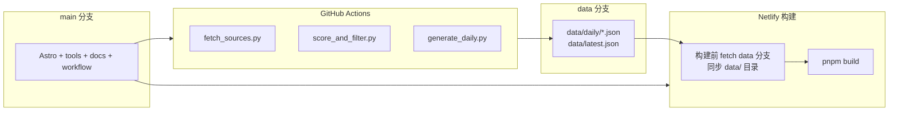

# AIpulse 数据分支方案设计文档

> 目标：实现 `main` 仅承载代码、`data` 分支仅承载正式数据，Netlify 在构建期主动拉取 `data` 分支内容参与静态构建。

## 1. 设计结论

采用以下方案：

- `main`：代码主分支
- `data`：正式数据分支
- GitHub Actions：每日产数后 push 到 `data`
- Netlify：从 `main` 触发构建，但在 build 前 fetch `origin/data` 并把其中的 `data/` 同步到工作目录

这套设计保持：

- 前端继续读取本地 `data/*.json`
- 不引入运行时数据库/API 依赖
- 代码历史与数据历史分离

## 2. 目标架构



## 3. 分支职责

### 3.1 `main`

保留：

- `src/`
- `tools/`
- `.github/workflows/`
- `docs/`
- `package.json`
- `pyproject.toml`
- `netlify.toml`

不再承载：

- 每日生成的正式 `data/daily/*.json`
- `data/latest.json`

### 3.2 `data`

保留正式构建数据：

- `data/daily/*.json`
- `data/latest.json`

第一阶段明确不保留：

- `data/raw/*.json`
- `data/scored/*.json`

这样做的目的：

- 避免 `data` 分支继续膨胀
- 保持 `data` 分支只承载前端构建必需品

## 4. 工作流设计

## 4.1 当前问题

现有 workflow 的最后一步直接：

- `git add data/daily/ data/latest.json`
- `git commit`
- `git push`

这会把数据写回当前检出的代码分支。

## 4.2 目标行为

workflow 应拆成两个逻辑阶段：

1. 在 `main` 工作目录中运行抓取、打分、生成
2. 将生成结果同步到 `data` 分支并提交

## 4.3 推荐实现

推荐使用单 workflow 内的双工作区策略：

1. checkout `main`
2. 跑 Python pipeline，生成本地 `data/`
3. 在临时目录 checkout `data` 分支
4. 清理并覆盖该临时目录中的正式数据文件
5. 在临时目录执行 commit / push 到 `data`

这样可以避免：

- 在同一个 git worktree 里频繁切分支
- 把代码分支工作区弄脏

### 4.4 权限前提

在改 workflow 前，必须先确认：

- workflow 具备 `contents: write`
- `GITHUB_TOKEN` 可向 `data` 分支 push
- `data` 分支保护规则不会阻止 bot 写入

如果这些前提未满足，先修权限，再改 workflow。

## 4.5 workflow 输出边界

必须明确：

- workflow 正式输出的是 `data` 分支内容
- `main` 中的本地生成数据只属于 CI 过程临时产物

## 5. Netlify 构建设计

## 5.1 当前问题

Netlify 默认只拿当前站点绑定分支的工作树内容。

如果站点绑定 `main`，那么 `data` 分支内容不会自动进入构建目录。

## 5.2 目标行为

在 `pnpm build` 前增加一个“同步正式数据”的步骤：

1. `git fetch origin data`
2. 从 `origin/data` 导出 `data/` 目录
3. 覆盖当前构建工作区的 `data/`
4. 再执行 `pnpm build`

## 5.3 推荐实现方式

推荐新增一个 repo 内脚本，例如：

- `tools/sync_data_branch.(js|mjs|py|ps1/sh)`

职责：

- 拉取 `origin/data`
- 将 `origin/data:data/` 同步到当前工作区 `data/`
- 在缺失时给出清晰报错

然后 Netlify build command 改成类似：

```bash
pnpm sync:data && pnpm build
```

## 5.4 构建触发策略

只在 Netlify build 里支持 fetch `data` 还不够，因为 `data` 分支更新本身不会自动触发 `main` 的新构建。

第一阶段明确采用：

- GitHub Actions 在成功 push `data` 分支后，调用 Netlify build hook

这样可以保证：

- 每次正式数据更新后，Netlify 都会执行一次新的构建
- 构建时再通过 `sync:data` 拉取 `origin/data`

不采用的方案：

- 在 `main` 上制造无意义 commit 来触发构建
- 依赖 Netlify 自动感知另一个分支变化

## 5.5 为什么不改前端读取逻辑

因为 Astro 当前已经稳定读取：

- `data/daily/*.json`
- `data/latest.json`

如果构建前把 `data` 分支同步到本地目录，前端层无需改数据接口，风险最小。

## 6. 文档与约束更新

需要同步更新：

- `README.md`
- `docs/aipulse-deployment-guide.md`
- `docs/resume-context.md`（如有必要）

需要写清：

- `main` 只维护代码
- `data` 分支维护正式数据
- 本地可验证，但正式线上数据以 GitHub Actions 为准

## 7. 失败与回退策略

### 7.1 workflow 推送失败

如果 `data` 分支 push 失败：

- 不应污染 `main`
- 当次数据更新失败，保留上一次线上数据
- workflow 日志中必须能明确看到失败阶段

### 7.2 Netlify 拉数失败

如果构建前无法同步 `data` 分支：

- 构建应明确失败，而不是默默使用空目录
- 避免站点构建出“无数据版”

### 7.3 首次初始化

首次启用时需要：

1. 创建 `data` 分支
2. 写入基础 `data/` 结构
3. 确保 Netlify 构建脚本能处理首次同步

第一阶段明确采用人工初始化：

- 由维护者一次性创建 `data` 分支
- 放入最小可用 `data/` 目录结构
- 之后再交给 workflow 日常维护

不要把“自动创建分支”塞进每日 workflow。

## 8. 实施顺序建议

最稳顺序：

1. 先补设计文档和任务清单
2. 再改 workflow 输出分支
3. 再补 Netlify 构建前同步脚本
4. 再接入 Netlify build hook
5. 最后更新 README / deployment docs

不要先改前端读取层。

## 9. 验收标准

设计落地完成后，应满足：

- GitHub Actions 每日只向 `data` 分支推送数据
- `main` 不再出现新的 daily data commit
- Netlify 基于 `main` 构建时能读取到 `data` 分支最新数据
- `data` 分支更新后能稳定触发新的 Netlify 构建
- 页面行为与当前静态数据读取模式保持兼容
