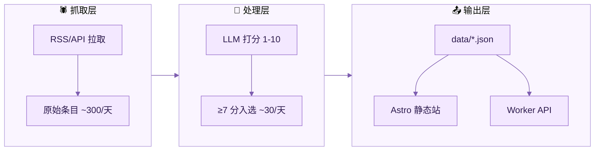

# AIpulse 设计文档

> AI 资讯聚合服务。每天从噪音中筛出信号。
> 域名：`pulse.ouraihub.com`

## 定位

面向中文 AI 从业者和爱好者的每日精选资讯。LLM 自动抓取、打分、筛选、摘要，每天一次更新。

## 架构



## 技术栈

| 组件 | 技术 | 费用 |
|------|------|------|
| 抓取 + 处理 | GitHub Actions (cron) | 免费 |
| LLM 打分/摘要 | MiMo API | ~$0.03/天 |
| 静态站 | Astro + GitHub Pages | 免费 |
| API 服务 | Cloudflare Worker + KV | 免费 |
| 域名 | `pulse.ouraihub.com`（已有 Cloudflare） | 免费 |

**总成本：~$1/月**（仅 LLM token）

## 数据源

### 英文官方博客（RSS）

| 源 | RSS URL |
|----|---------|
| OpenAI Blog | `https://openai.com/blog/rss.xml` |
| Anthropic News | `https://www.anthropic.com/rss.xml` |
| Google DeepMind | `https://deepmind.google/blog/rss.xml` |
| Meta AI Blog | `https://ai.meta.com/blog/rss/` |
| HuggingFace Blog | `https://huggingface.co/blog/feed.xml` |
| Mistral AI | `https://mistral.ai/feed.xml` |

### 论文（API）

| 源 | 方式 |
|----|------|
| arXiv cs.AI | `https://export.arxiv.org/api/query?search_query=cat:cs.AI&sortBy=submittedDate&max_results=50` |
| arXiv cs.CL | 同上，`cat:cs.CL` |
| HuggingFace Daily Papers | `https://huggingface.co/api/daily_papers` |

### GitHub

| 源 | 方式 |
|----|------|
| Trending repos (AI) | GitHub API `/search/repositories?q=topic:ai+created:>YYYY-MM-DD&sort=stars` |
| 重要 releases | 监控列表：mermaid-js/mermaid, langchain-ai/langchain, ollama/ollama 等 |

### 中文公众号

| 号 | 抓取方式 |
|----|---------|
| 机器之心 | RSS 桥（WeRSS / feeddd.org） |
| 量子位 | RSS 桥 |
| Founder Park | RSS 桥 |
| 海外独角兽 | RSS 桥 |

> 公众号抓取是最不稳定的源。初期可以先跳过，用 RSS 桥能抓就抓，抓不到不影响主流程。

### X/Twitter

| 账号 | 方式 |
|------|------|
| @kaborosky (Karpathy) | Nitter RSS / RSSHub |
| @_akhaliq (AK) | Nitter RSS / RSSHub |
| @dotey (宝玉) | Nitter RSS / RSSHub |
| @op7418 (歸藏) | Nitter RSS / RSSHub |
| @AnthropicAI | Nitter RSS / RSSHub |

> Twitter 源也不稳定（Nitter 经常挂）。作为补充源，挂了不影响主流程。

### Product Hunt

| 源 | 方式 |
|----|------|
| AI 类新品 | `https://www.producthunt.com/feed?category=artificial-intelligence` |

## 处理流程

### 每日 cron（北京时间 07:00 触发）

```
1. 拉取所有源的新条目（过去 24 小时）
2. 去重（按 URL）
3. LLM 打分（批量，每条一个 prompt）
4. 筛选 ≥7 分的条目
5. LLM 生成中文标题 + 50 字摘要（对英文条目）
6. 分类（ai-models / ai-products / industry / paper / tip）
7. 生成 data/daily/{date}.json
8. 更新 data/latest.json
9. 推到 repo → 触发 Pages 构建
10. 写入 Worker KV（供 API 查询）
```

### LLM 打分 Prompt

```
你是一个 AI 资讯编辑。请对以下条目打分（1-10），标准：
- 对中文 AI 从业者的价值（新模型发布、重要产品更新、行业趋势）
- 信息的新鲜度和独特性
- 不是广告、不是水文

标题：{title}
来源：{source}
摘要：{summary}

只输出一个数字。
```

### LLM 摘要 Prompt

```
用一句中文（50字以内）概括这条 AI 资讯的核心信息。不要套话，直接说发生了什么。

标题：{title}
内容：{content}
```

## 数据结构

### `data/daily/{date}.json`

```json
{
  "date": "2026-05-09",
  "generatedAt": "2026-05-09T07:00:00Z",
  "total": 32,
  "items": [
    {
      "id": "sha256-前8位",
      "title": "中文标题",
      "title_en": "English Title（如有）",
      "url": "https://...",
      "source": "OpenAI Blog",
      "category": "ai-models",
      "score": 9,
      "summary": "50字中文摘要",
      "publishedAt": "2026-05-09T02:30:00Z"
    }
  ]
}
```

### `data/latest.json`

最近 7 天的合并数据（供 API 快速查询）。

## API 设计（Cloudflare Worker）

| 路由 | 方法 | 说明 |
|------|------|------|
| `/api/daily` | GET | 最新日报 |
| `/api/daily/{date}` | GET | 指定日期 |
| `/api/items` | GET | 查询条目 |

### `/api/items` 参数

| 参数 | 说明 | 默认 |
|------|------|------|
| `since` | ISO 8601 时间 | 7 天前 |
| `category` | ai-models/ai-products/industry/paper/tip | 全部 |
| `q` | 关键词搜索（标题+摘要） | 无 |
| `take` | 返回条数 | 50 |

## 页面渲染方案

### 方案选择

不采用 `hugowind` 作为 AIpulse 的页面渲染基座，原因如下：

- `hugowind` 更适合博客、品牌站、landing page 这类“内容主题驱动”的站点
- AIpulse 的核心对象是日报条目流、分类流和归档流，属于“数据驱动渲染”
- AIpulse 后续还会接 Worker API、站内查询、按时间和分类浏览，前端结构应围绕 JSON 数据组织，而不是围绕文章内容模型组织

因此，P2 前端采用：

- **Astro 作为静态站框架**
- **以 `data/daily/*.json` 和 `data/latest.json` 为唯一页面数据源**
- **页面组件围绕“日报流”“归档流”“分类流”设计**

### 前端目标

前端不是博客壳，而是一个轻量的信息产品：

- 首页直接展示当天最值得看的 AI 资讯
- 用户能快速扫读、跳转原文、按分类回看
- 历史内容可以按日期归档，保持“日报”心智
- 页面默认静态输出，减少运行时复杂度

### 页面

| 路径 | 内容 | 数据来源 |
|------|------|----------|
| `/` | 今日精选（当天各分类分组 + Top items） | `data/daily/{latest-date}.json` |
| `/archive` | 日报归档列表（最近 7 天优先，可扩展全部历史） | `data/latest.json` + `data/daily/*.json` |
| `/archive/{date}` | 指定日期日报 | `data/daily/{date}.json` |
| `/category/{slug}` | 某一分类最近 7 天条目流 | `data/latest.json` |
| `/about` | 产品说明、数据来源、更新频率、免责声明 | 静态内容 |

### 页面结构

#### 首页 `/`

首页承担“打开就能看”的职责，首屏直接给内容，不做营销页。

建议结构：

1. 顶部品牌栏
   - AIpulse 标识
   - 更新时间
   - 跳转归档入口
2. 今日头条区
   - 展示当天分数最高的 3-5 条
   - 强化标题、来源、摘要、原文链接
3. 分类日报区
   - 按 `ai-models` / `ai-products` / `industry` / `paper` / `tip` 分段展示
   - 每段显示 3-8 条，按分数降序
4. 底部说明区
   - 数据更新时间
   - 数据源说明
   - “查看历史日报”入口

#### 归档页 `/archive`

- 按日期倒序展示日报列表
- 每天展示：
  - 日期
  - 当日总条数
  - 分类分布
  - 前 2-3 条代表性资讯
- 目的是帮助用户快速定位某一天，而不是全文展开

#### 单日日报页 `/archive/{date}`

- 使用与首页一致的日报布局
- 页面标题显式显示日期
- 可以加入“上一日 / 下一日”导航

#### 分类页 `/category/{slug}`

- 展示最近 7 天该分类的所有条目
- 默认按 `publishedAt` 倒序，同分数时分数高者优先
- 页面顶部显示分类说明，如：
  - `ai-models`: 模型发布/更新
  - `ai-products`: 产品发布/更新
  - `industry`: 行业动态
  - `paper`: 论文研究
  - `tip`: 技巧与观点

### 数据驱动方式

建议 P2 前端不去改造 P1 的 Python 流程，而是在构建阶段做一次轻量数据整形。

静态站侧增加一层只读适配：

```text
data/
  daily/
    2026-05-09.json
  latest.json
src/
  lib/
    content.ts        # 读取 daily/latest 数据
    categories.ts     # 分类映射和标签
    dates.ts          # 日期格式化
```

职责划分：

- Python 流程负责“抓、筛、生成 JSON”
- Astro 层负责“读 JSON、整形、渲染页面”
- Worker API 负责“对外查询接口”

这样前后职责清楚，后续无论页面改版还是 API 扩展，都不需要回头破坏 P1。

### 组件设计

建议前端组件从一开始就围绕资讯流设计，而不是文章模板设计。

核心组件建议如下：

| 组件 | 作用 |
|------|------|
| `BaseLayout` | 全站基础布局、SEO、头尾 |
| `HeaderBar` | 品牌、导航、更新时间 |
| `DailyHero` | 首页头条区 |
| `SectionBlock` | 某个分类分段 |
| `NewsCard` | 单条资讯卡片 |
| `ArchiveDayCard` | 归档页中的某日摘要卡片 |
| `CategoryTabs` | 分类导航 |
| `EmptyState` | 无数据时的占位 |

其中 `NewsCard` 建议固定承载：

- 中文标题
- 英文标题（如有，可弱化显示）
- 来源
- 发布时间
- 分类标签
- 分数
- 中文摘要
- 原文链接

### 视觉方向

整体风格保留你原来想要的“黑白为主，紫色点缀”，但不要照搬主题站的视觉语言。

建议：

- 基础配色：白底 / 近黑正文 / 中性灰辅助信息 / 紫色强调
- 排版：以列表阅读效率优先，少装饰
- 首页不是 hero landing，而是信息面板式首页
- 不做大面积卡片堆叠，重点突出内容密度和扫描效率
- 移动端优先，桌面端提升为双栏或宽列表

### 技术约束

- 采用 **Astro 静态输出**
- 默认不引入 React/Vue/Svelte 运行时
- 搜索、筛选等功能优先做构建期和 URL 级别能力，避免过早引入复杂客户端状态
- 与 Worker API 的关系是“前端可不用 API 也能独立工作”；API 主要服务外部集成和后续扩展

### 与 `hugowind` 的关系

`hugowind` 不作为基座，但可以参考它的以下优点：

- 配色和细节节奏
- SEO/元信息处理思路
- 多端响应式排版方式
- 深浅色模式处理方式（如果 AIpulse 后续需要）

不建议复用的部分：

- 博客文章页语义
- landing/marketing 页面结构
- 基于 Hugo content model 的页面组织方式

### P2 建议仓库结构

```text
ouraihub/aipulse/
├── src/
│   ├── components/
│   │   ├── ArchiveDayCard.astro
│   │   ├── CategoryTabs.astro
│   │   ├── DailyHero.astro
│   │   ├── HeaderBar.astro
│   │   ├── NewsCard.astro
│   │   └── SectionBlock.astro
│   ├── layouts/
│   │   └── BaseLayout.astro
│   ├── lib/
│   │   ├── categories.ts
│   │   ├── content.ts
│   │   └── dates.ts
│   └── pages/
│       ├── index.astro
│       ├── about.astro
│       ├── archive/
│       │   ├── index.astro
│       │   └── [date].astro
│       └── category/
│           └── [slug].astro
├── data/
├── tools/
├── worker/
├── astro.config.mjs
└── package.json
```

### P2 验收标准

1. 首页能直接读取最新日报并完成静态渲染
2. 归档页能列出历史日报并跳转到单日详情
3. 分类页能按 `latest.json` 聚合显示最近 7 天条目
4. 页面在移动端和桌面端都具备良好的可读性
5. 不依赖运行时 API，直接使用仓库内 JSON 构建即可部署

## Skill 设计

```
skills/aipulse/SKILL.md
```

调用 `pulse.ouraihub.com/api/*`，格式化输出中文资讯简报。触发词：AI 资讯、AI 日报、AI 热点、今天 AI 圈有什么。

## 仓库结构

```
ouraihub/aipulse/
├── .github/workflows/
│   └── fetch.yml              # 每日 cron 抓取+处理
├── src/                       # Astro 站点源码
│   ├── pages/
│   ├── layouts/
│   └── components/
├── worker/                    # Cloudflare Worker API
│   ├── index.js
│   └── wrangler.toml
├── tools/                     # Python 抓取+处理脚本
│   ├── fetch_sources.py       # 拉取所有源
│   ├── score_and_filter.py    # LLM 打分筛选
│   ├── generate_daily.py      # 生成日报 JSON
│   └── sources.yaml           # 数据源配置
├── data/                      # 生成的数据（git tracked）
│   ├── daily/
│   └── latest.json
├── skills/
│   └── aipulse/SKILL.md      # 配套 Skill
├── astro.config.mjs
└── package.json
```

## 实施计划

| 阶段 | 内容 | 预估 |
|------|------|------|
| P1 | 基础抓取（RSS 源 + arXiv + GitHub）+ LLM 打分 + JSON 输出 | 1 次会话 |
| P2 | Astro 静态站 + GitHub Pages 部署 | 1 次会话 |
| P3 | Worker API + Skill | 1 次会话 |
| P4 | 补充源（公众号、Twitter、Product Hunt） | 按需 |

**建议从 P1 开始**：先跑通「抓取 → 打分 → 输出 JSON」的核心流程，确认数据质量后再做前端和 API。

## 与 msgflow 的集成

AIpulse 跑通后，可以在 msgflow 里加一个指令：

```
AI日报    → 调 pulse.ouraihub.com/api/daily，回传今日精选
AI热点    → 同上
```

用户在飞书/Telegram 发「AI日报」就能收到当天的 AI 资讯精选。
